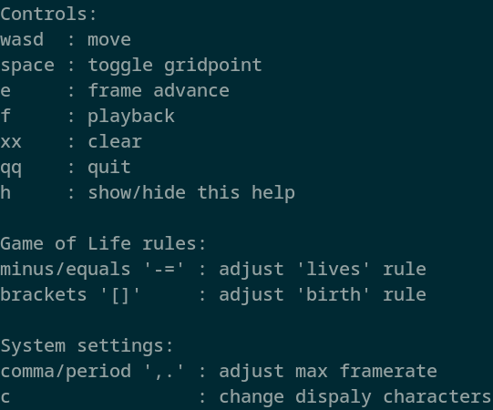

# cursed_life 0.14.0
basically game of life in tui. doesn't use cutting-edge algorithms. more of a small Rust exercise than anything.

first version was based in ncurses, hence the name.

## Playing
Just run the file in a terminal, use 'h' to show/hide controls.

Don't resize the window; that's not implemented yet.

## Building
Uses `crossterm` crate which claims to be platform-agnostic. Can guarantee it works in Linux.
