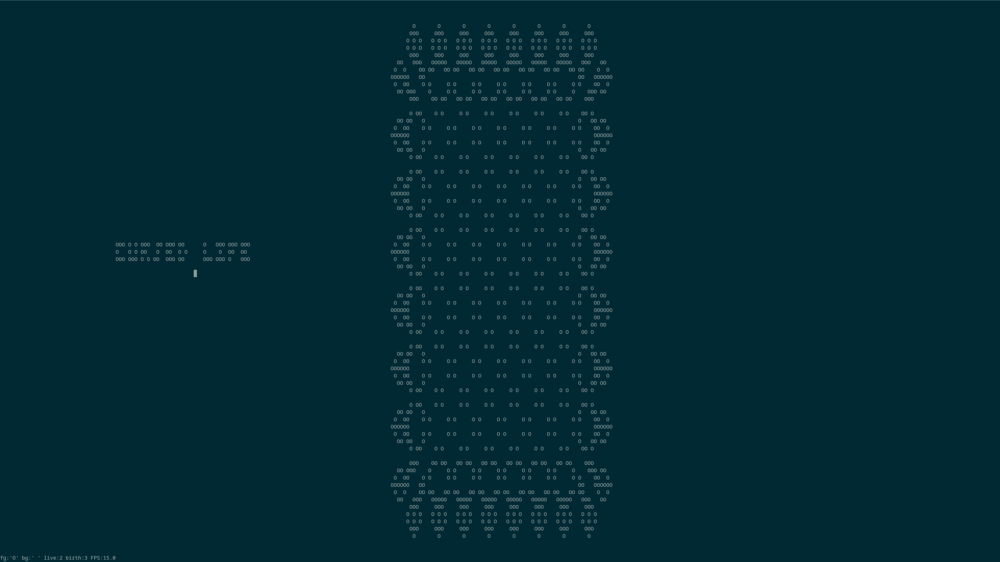

# cursed_life 0.10.0
basically game of life in ncurses. doesn't use cutting-edge algorithms. more of a small Rust exercise than anything.

## Info
### Controls
 - wasd  : move
 - space : toggle gridpoint
 - e     : frame advance
 - f     : playback. I don't like this binding, might change it.
 - xx    : clear
 - qq    : quit

Game of Life rules.
 - minus/equals '-=' : adjust 'lives' rule
 - brackets '[]'     : adjust 'birth' rule

System settings
 - comma/period ',.' : adjust max framerate. more of a guideline, based on delays.

### Playing
Just run the file, use space to manually add lifeforms, and press e or f to advance. Don't resize the window, that's not implemented yet.

### Building
Uses `pancurses` crate which claims to be platform-agnostic. Can guarantee it works in Linux.
