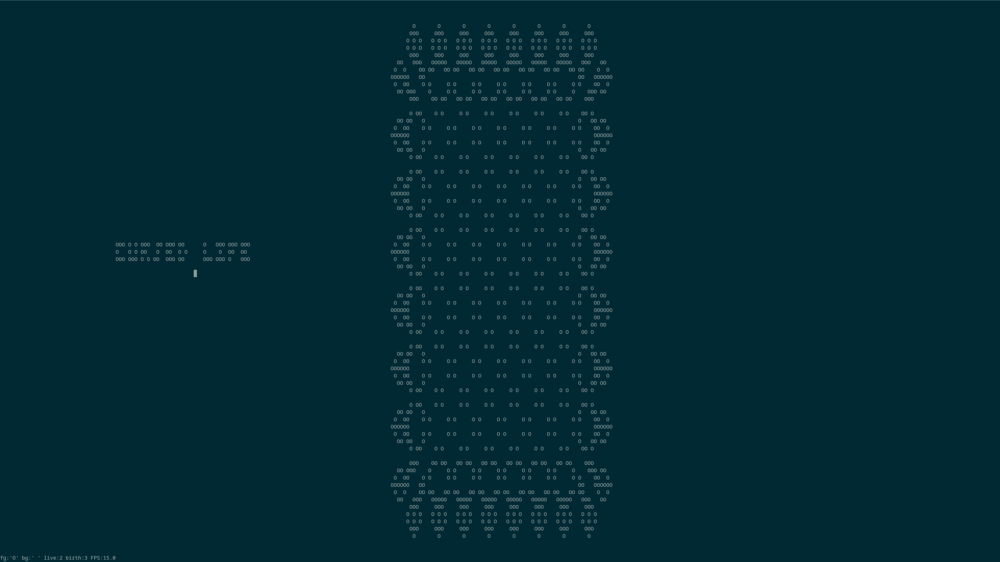
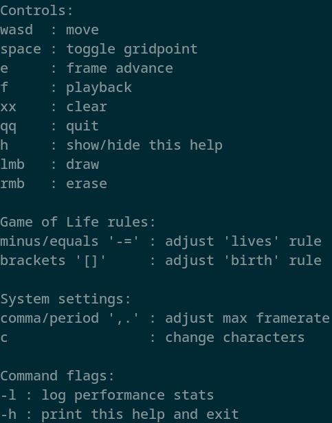

# cursed_life 1.0.1
Basically game of life in tui. Pretty basic, more of a small Rust exercise than anything.

First version was based in ncurses, hence the name. Now uses Crossterm.

## Playing
Just run the file in a terminal, use 'h' to show/hide controls.

## Building
Uses `crossterm` crate which claims to be platform-agnostic. Tested in...

 - Linux:
 - - Alacritty
 - - XTerm
 - - TTY
 - Windows:
 - - Powershell
 - - CMD
